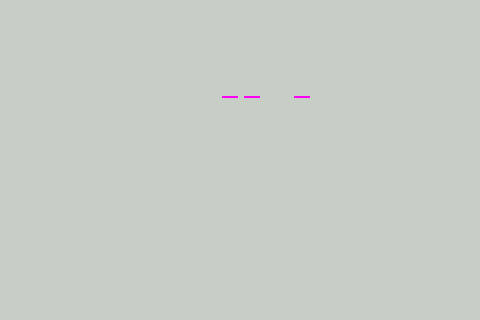
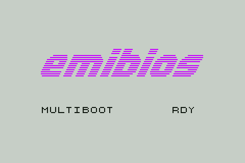
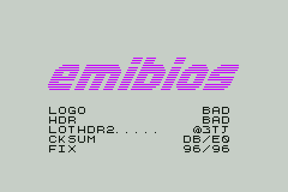

# emibios: a GBA BIOS replacement
**Download latest: [gba_bios.bin | 0.1.4](https://github.com/coolbho3k/emibios/releases/download/0.1.4/gba_bios.bin)**

emibios is a research [Game Boy Advance](https://en.wikipedia.org/wiki/Game_Boy_Advance) BIOS replacement that aims to be as accurate as possible
when running commercial games while being freely redistributable. It is not intended to contain,
or use as reference, any proprietary code directly derived from the retail BIOS. Instead, we
rely on observing and matching the behavior of the retail BIOS.

Originally based on [Cult-of-GBA BIOS](https://github.com/Cult-of-GBA/BIOS/) by fleroviux and
DenSinH.

  

### Features

- Runs most commercial games
- Compatible with most software emulators and FPGA cores
- Syncs with the retail BIOS in TAS playback in many games
- Most SWIs are accurate in both result and register/flag side effects
- Many SWIs are tuned to match the retail BIOS in timing for most inputs
- Some SWIs are adjusted for timing under bus/IRQ/DMA contention where it was observed to affect accuracy for tested commercial games
- Multiboot (Normal/Multiplay sender and receiver, JoyBus receiver), tested on FPGA hardware and GameCube with real link cables as well as mGBA/Dolphin.
- Sound functionality used in commercial games (as far as I know, let me know if I missed anything or you find any bugs) is implemented, including Digital Eclipse / a few Japanese titles
- All-new boot screen, featuring a readout of the game name/code, plus a header debug screen if you hold B or if the cart contacts are dirty

### Running

Download the [latest release](https://github.com/coolbho3k/emibios/releases/latest) and load it into your favorite GBA emulator!

It takes the place of the official `gba_bios.bin`.

emibios will probably also run on official silicon if you can manage to figure out how, but as far
as I know, this is impossible (let me know if you own debug hardware that can do this or know of a
way to do this on any retail hardware).

### Building

[Zig](https://ziglang.org) 0.16 is the toolchain and the only build prerequisite needed.

    zig build         # builds zig-out/bin/gba_bios.bin

Unit tests assert behavior, side effects, and timing of many SWIs:

    zig build test    # runs tests against our BIOS

Build a BIOS accuracy test ROM:

    zig build rom     # builds zig-out/bin/test_rom.gba

### Disclaimer

This is a research project and should not be considered production-ready just yet. emibios is not
perfect yet. Although I have tried to fix all crashes I've found so far, many games will still
desync in TAS playback, and I can't test every game and homebrew out there. However, the goal is to
eventually get as close in observable functionality to the retail BIOS as possible. This means fixing
any crashes that are found and aiming for determinism given the same sequence of inputs in games as
the retail BIOS.

Please help me test commercial games, particularly those that use the sound SWIs and those that
exercise Multiboot functionality. Note that games that are historically difficult to emulate accurately
are not necessarily difficult to get running on an open BIOS replacement, and vice versa.

Some of the SWI code seems unconventional or inefficient. Most of the time, this was a result of
efforts to match original timing.

### AI Disclosure

LLMs were used to propose and run the thousands of experiments required for this project. They also
wrote some assembly and Zig. Outputs were fully attended to and checked by me. Great care was taken to
firewall them against ingesting proprietary code or binaries into their context.

### Credits

- [Cult-of-GBA](https://github.com/Cult-of-GBA/BIOS/) (fleroviux, DenSinH) - original open BIOS basis for this project
- [GBAHawk](https://github.com/alyosha-tas/GBAHawk) (alyosha) - primary development target, test runner
- [MesenCE](https://github.com/nesdev-org/MesenCE) - secondary development target, test runner
- [mGBA](https://mgba.io/) (endrift) - secondary development target, reference code, Multiboot/JoyBoot development target
- [NanoBoyAdvance](https://codeberg.org/nba-emu/NanoBoyAdvance) (Gloria Goertz, fleroviux) - secondary development target
- [Fonts for GB Studio](https://jeremyoduber.itch.io/fonts-for-gb-studio) (Jeremy Oduber) - boot screen font
- [jbus](https://github.com/AxioDL/jbus) - Multiboot/JoyBus reference
- [Dolphin Emulator](https://dolphin-emu.org/) - used as sender to develop JoyBoot receiver code
- [GBATEK](https://problemkaputt.de/gbatek.htm) (Martin Korth) - invaluable reference
- [openFPGA-GBA](https://github.com/spiritualized1997/openFPGA-GBA) (spiritualized1997) - hardware target for Multiboot/JoyBoot functionality

### License

The BIOS itself is LGPL-3.0-or-later by default. Tests and some tooling are MIT.
